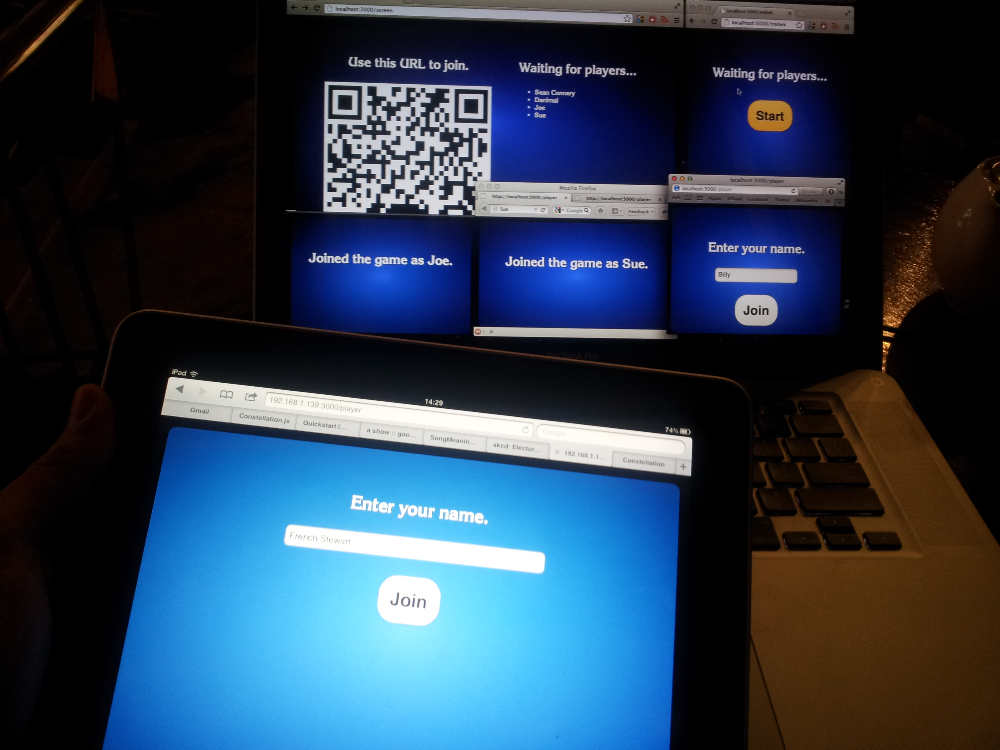

Host and player controllers for Mack Flavelle's Developer Jeopardy meetup.
http://www.meetup.com/Vancouver-Tech-Co-Founders/events/86554782

Installation

First, modify app.js and set the URL to your app. Look for this line and update it:

var appUrl = 'http://example.com/path/to/devjep';

Then from the terminal run,

> node app.js

To display the host controller navigate to [base_url]/trebek.

Now to display the main screen navigate to [base_url]/screen.

The link for players to join will automagically appear on the screen or you can manually enter [base_url]/player.

Notes

- The node modules are already in there so npm install shouldn't be necessary.
- This is not a secure implementation. Hopefully you're in a situation where you can trust your users not to cheat.
- Thanks to [Kazuhiko Arase](http://www.d-project.com) for his Javascript QR code library. 
